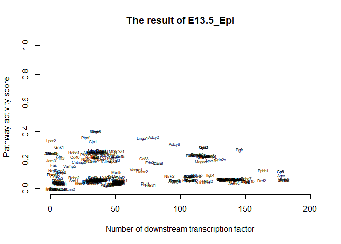

<!-- README.md is generated from README.Rmd -->

SPAGI2: Identification of active signalling pathways for cross-species by integrating gene expression and human protein interaction network
===========================================================================================================================================

**Md Humayun Kabir**
(<a href="mailto:humayun.mkabir@gmail.com" class="email">humayun.mkabir@gmail.com</a>;
<a href="mailto:hkj_cse@ru.ac.bd" class="email">hkj_cse@ru.ac.bd</a>)

Introduction
------------

This file contains the R code to run an example workflow for active
signalling pathway identification of mouse dental epithelium cell at
embryonic day E13.5 microarray gene expression data using the *SPAGI2*
package. The package can help to identify the active signalling pathways
based on gene expression profile by using a pre-built new human
background pathway path data. Before creating the background data, we
have built a random forest classification model to classify all the
biomart ensembl genes by utilizing their gene ontology (GO) annotations.
We have developed four separate R files to create the new human
background pathway path data. These files and the molecule data sets to
run the first R file are stored in the *additional\_file* folder in the
*SPAGI2* github repository
<a href="https://github.com/humayun2017/SPAGI2/tree/master/additional_file" class="uri">https://github.com/humayun2017/SPAGI2/tree/master/additional_file</a>.
One can look and regenerate the results by utilizing the R files
sequentially - *molecule\_go\_map.R*, *molecule\_classification.R*,
*molecule\_classification\_model.R* and *generate\_pathway.R*. The
necessary instructions to run these R files are given in the beginning
of the files. To create the background pathway path data first we have
utilized the PPI data from STRINGdb for the human molecules, then
applied graph shortest path algorithm to get the pathway paths and
finally filtered out the paths where all molecules are housekeeping
genes. We have used the list of housekeeping genes as described from the
*SPAGI* package.

All the necessary data to run the example workflow are deposited in the
*SPAGI2* github repository
<a href="https://github.com/humayun2017/SPAGI2/tree/master/data" class="uri">https://github.com/humayun2017/SPAGI2/tree/master/data</a>.
These data are automatically loaded with the package. This may take some
time during installation.

Please note that the query gene expression data should be normalized and
log2 scale form. Also note that the background pathway path and
housekeeping gene data are in official gene symbol format. The gene ids
and specie names must be valid as supported by biomaRt ensembl. So
please provide valid gene ids and species name supported by ensembl
before using with SPAGI2 package. To see the valid gene ids of a species
that have mapping to the *external\_gene\_name*, one can look at the
*find\_valid\_geneID()* function of the *SPAGI2* package. Also, to see
the currently ensembl supported species, one can look at the
*find\_supported\_datasets()* function of the *SPAGI2* package. The
*SPAGI2* or *SPAGI* package does not perform any normalization or log2
scale format. It assumes that all RNA-seq query data are in
RPKM/FPKM/CPM normalized and log2 scale format. For micro-array data
sets be aware that extra steps like background subtraction and quantile
normalization are recommended before log2 scale format.

To utilize the SPAGI2 package, you have to provide an expression cut-off
threshold and a high expression threshold (i.e., an expression value
that is high enough) for your query data. To look at the distribution of
the query data you can unilize the helping function
*show\_distribution()* of the package and then fix the expression
cut-off threshold and a high expression threshold values. The package
assumes that all the query data are in normalized and log2 scale form
and the gene ids and species names are valid. Finally, the gene
expression data must be in matrix format with replicated column headers
per-replicate for each cell type or tissue.

Sometimes you might get temporarily disconnected from the BioMart web
server with an error message like:  
Error in bmRequest(request = request, verbose = verbose) :  
Internal Server Error (HTTP 500).  
If this happens just try to re assign the variable *host.ID* with an
archived version.  
For example -  
host.ID &lt;-
“<a href="http://sep2019.archive.ensembl.org" class="uri">http://sep2019.archive.ensembl.org</a>”  
Alternatively the BioMart web service is temporarily down. Just wait for
the BioMart web service up again.

Installation
------------

*SPAGI2* depends on the packages *biomaRt*, *slam*, *data.table*,
*igraph* and *spagi*. To generate the background pathway path data it
relies on package *STRINGdb*. Make sure you have installed all the
packages. The commands to do so are as follows:

Open an R session and do the following: If ‘BiocManager’ is not already
installed, first install ‘BiocManager’ to insall the bioconductor
packages. Type the following in an R command window:

    if(!requireNamespace("BiocManager", quietly = TRUE))
      install.packages("BiocManager")

    BiocManager::install("biomaRt")
    BiocManager::install("STRINGdb")
    install.packages('data.table')
    install.packages('igraph')
    install.packages('slam')

Make sure you have *devtools* installed, then install the *SPAGI* and
*SPAGI2* package from github repository:

    install.packages('devtools')
    devtools::install_github('VCCRI/SPAGI')
    devtools::install_github('humayun2017/SPAGI2')

Finally load the packages with:

    library(biomaRt)
    library(data.table)
    library(slam)
    #> Warning: package 'slam' was built under R version 3.6.2
    #> 
    #> Attaching package: 'slam'
    #> The following object is masked from 'package:data.table':
    #> 
    #>     rollup
    library(STRINGdb)
    library(igraph)
    #> Warning: package 'igraph' was built under R version 3.6.3
    #> 
    #> Attaching package: 'igraph'
    #> The following objects are masked from 'package:stats':
    #> 
    #>     decompose, spectrum
    #> The following object is masked from 'package:base':
    #> 
    #>     union
    library(spagi)
    library(spagi2)

When Ensembl move servers (rarely) or it is down (less rare) these
variable may need to be changed, When used in package, these variables
need to be global. So, assign these variables before running the
package.

    biomart.ID <- "ENSEMBL_MART_ENSEMBL"
    host.ID <-  "www.ensembl.org"
    #Or,
    #host.ID <- "asia.ensembl.org"
    #Or, for example to an archived version
    #host.ID <- "http://sep2019.archive.ensembl.org"

Package installation and loading is done!

You are now ready to run the example.

You can run the entire following example using:

    example(spagi2)

Example
-------

In this example workflow we will use *pathway.path.new* as background
data from the *SPAGI2* repository. Also we will use *tooth.epi.E13.5* as
query microarray gene expression data ([Science
Signaling](https://stke.sciencemag.org/content/5/206/ra4/tab-pdf)). The
*tooth.epi.E13.5* data has three biological replicates. The query data
is already in normalized and log2 scale form. Also we have made the
column names of the replicates identical as these are from same cell
type. These data sets are loaded automatically with the package.

### Pre-process the query data

The query data has already been made in normalized and log2 format.
Here, we will use the expression cutoff as 5.0 of the query data. You
can look at the distribution of the query data by using the helping
function *show\_distribution()* of the package and then fix the
expression cut-off threshold value. Also we have already made the
replicate names same for the data.

    tooth.epi.E13.5.processed.data<-preprocess_querydata_new(cell.tissue.data = tooth.epi.E13.5, exp.cutoff.th = 5.0, species="mmusculus")

### Generate the mouse homology pathway path data

Here we will use the background human *pathway.path.new* data to get the
mouse homology pathway path data. It will take little bit more time to
access the biomaRt ensembl server.

    mouse.homology.pathway.path<-generate_homology_pathways(species1 = "hsapiens", species2 = "mmusculus", pathway.path = pathway.path.new)
    #> Cache found

### Identify active pathway paths of the processed query data

Here we will use the *mouse.homology.pathway.path* data to get the
active pathway paths of the processed query data.

    tooth.epi.E13.5.active.pathway<-identify_active_pathway_path(pathway.path = mouse.homology.pathway.path, processed.query.data = tooth.epi.E13.5.processed.data)

### To save the active pathway paths in csv format

After getting the active pathway paths, you can save the data in csv
file format where each row will denote a path and all the paths starting
from the same source comprises of a pathway of the source protein.

    lapply(unlist(tooth.epi.E13.5.active.pathway$E13.5_Epi, recursive = F, use.names = F), write, "tooth.epi.E13.5.active.pathway.csv", append=T, ncolumns=10)

### To generate the data frame of the active pathway paths and then draw the pathway figures

After getting the active pathway paths, you can generate the data frames
of the active pathways and then save these to draw the pathway figures
using cytoscape. Also you can draw the pathway figures as tree layout
and store these in one pdf file in the current directory.

    tooth.epi.E13.5.active.pathway.df<-generate_pathway_ppi_data_frame(active.pathway.path = tooth.epi.E13.5.active.pathway)
    draw_active_pathways(tooth.epi.E13.5.active.pathway.df)

### Get active pathway ranking metric (i.e., activity score and number of downstream transcription factors)

Here we will use the *tooth.epi.E13.5.active.pathway* and
*tooth.epi.E13.5.processed.data* data sets to get the acitve pathway
ranking metric. Also we will use a high expression threshold (here we
will use 10) for the processed query data. You can look at the
distribution of the query data by using the helping function
*show\_distribution()* of the package and then fix the high expression
threshold value.

    tooth.epi.E13.5.active.pathway.ranking.metric<-get_pathway_ranking_metric(active.pathway.path = tooth.epi.E13.5.active.pathway, processed.query.data = tooth.epi.E13.5.processed.data, high.exp.th = 10)

### Plot the ranking metric result in a 2D plane

After getting the active pathway ranking metric result you can display
them in your preferred format. Here we will plot them in a 2D plane
where x-axis denotes the number of downstream transcription factors and
y-axis denotes the activity score for each pathway.

    display_pathway_ranking_metric(pathway.ranking.metric = tooth.epi.E13.5.active.pathway.ranking.metric)
    #> [1] "E13.5_Epi -- result plotting done!!"
    #To separate the top ranked pathways we can do this
    abline(v=45, h=0.2, lty=2, col="black")

### That’s it! Now perform your own analyses using the *SPAGI2* package.
